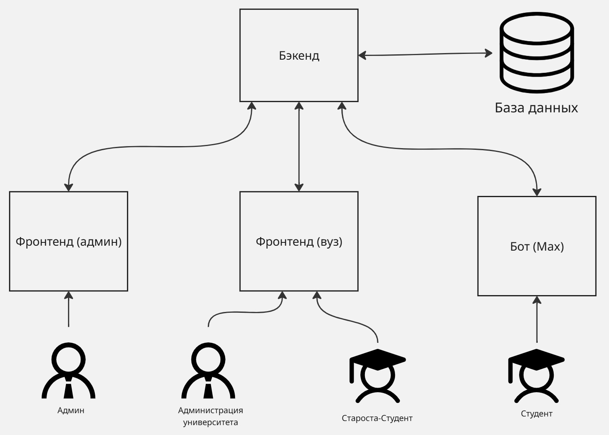

# StudGram
StudGram — образовательная платформа на базе чат-бота в мессенджере MAX и веб-приложения, где студенты управляют расписанием, заданиями и коммуникацией в одном месте.

Сервис развернут в мессенджере MAX (для студентов): https://max.ru/t589_hakaton_bot
Веб-приложение для администратора системы: https://admin.studgram.ru/ (логин `admin`, пароль `admin`)
Веб-приложение для администрации ВУЗа и старост: https://cp.studgram.ru/

## Архитектура
Микросервисная система для управления студенческими данными с поддержкой интеграции через мессенджеры.




Система состоит из следующих компонентов:

- **Backend API** (.NET 9.0) - RESTful API для управления данными
- **Bot** (Python 3.13) - Интеграция с мессенджерами (MAX, Telegram, VK)
- **Frontend Admin** (React) - Панель администратора
- **Frontend Institution** (React) - Панель учебного заведения
- **PostgreSQL 18.0** - База данных

## Описание Docker-образов

### 1. thon-db (PostgreSQL)
**Базовый образ:** `postgres:18.0`

**Описание:** Реляционная база данных для хранения всех данных системы (пользователи, учебные заведения, студенты, API токены).

**Переменные окружения:**
- `POSTGRES_DB` - название базы данных
- `POSTGRES_USER` - имя пользователя PostgreSQL
- `POSTGRES_PASSWORD` - пароль для доступа к БД

**Volumes:**
- `./pgdata:/var/lib/postgresql/data/pgdata` - персистентное хранилище данных

**Порты:** `5432:5432`

### 2. thon-backend (Backend API)
**Базовый образ:** Custom (.NET 9.0 Runtime)

**Описание:** ASP.NET Core Web API сервис, предоставляющий REST API для всех операций системы. Реализован с использованием Clean Architecture.

**Зависимости:** PostgreSQL (`thon-db`)

**Переменные окружения:**
- `DATABASE_CONNECTION_STRING` - строка подключения к PostgreSQL
- `INIT_ADMIN_LOGIN` - логин администратора (создается при первом запуске)
- `INIT_ADMIN_PASSWORD` - пароль администратора
- `HASH_SALT_1` - соль для хеширования паролей
- `HASH_SALT_2` - дополнительная соль для хеширования

**Dockerfile:** `./backend/Thon.Web/Dockerfile`
- Multi-stage build (build → publish → runtime)
- Base: `mcr.microsoft.com/dotnet/aspnet:9.0`
- SDK: `mcr.microsoft.com/dotnet/sdk:9.0`

**Порт:** `8080` (внутри контейнера)

### 3. thon-frontend-admin (Admin Panel)
**Базовый образ:** Custom (Node.js + React)

**Описание:** React-приложение для администраторов системы. Позволяет управлять учебными заведениями, API токенами, пользователями.

**Зависимости:** Backend API (`thon-backend`)

**Dockerfile:** `./frontend-admin/Dockerfile`
- Build stage: Node.js сборка React приложения
- Runtime: Nginx для раздачи статики

**Порт:** `80` или `3000` (зависит от Dockerfile)

### 4. thon-frontend-institution (Institution Panel)
**Базовый образ:** Custom (Node.js + React)

**Описание:** React-приложение для представителей учебных заведений. Управление факультетами и студентами своей организации.

**Зависимости:** Backend API (`thon-backend`)

**Dockerfile:** `./frontend-institution/Dockerfile`
- Аналогичен frontend-admin

**Порт:** `80` или `3000` (зависит от Dockerfile)

### 5. thon-bot-max (Messenger Bot)
**Базовый образ:** Custom (Python 3.13)

**Описание:** Асинхронный бот для взаимодействия со студентами через мессенджер MAX. Регистрация студентов, выбор учебного заведения, календарь событий.

**Зависимости:** Backend API (`thon-backend`)

**Переменные окружения:**
- `API_TOKEN` - токен для доступа к Backend API
- `BOT_TOKEN` - токен от мессенджера MAX
- `OPENROUTER_TOKEN` - токен для AI функций (опционально)

**Dockerfile:** `./bot/Dockerfile`
- Base: Python 3.13
- Установка зависимостей из `requirements.txt`

## Системные требования

### Минимальные требования

- **OS:** Linux, macOS, Windows (с WSL2 для Windows)
- **Docker:** версия 20.10 или выше
- **Docker Compose:** версия 2.0 или выше
- **RAM:** минимум 4 GB (рекомендуется 8 GB)
- **Disk:** минимум 10 GB свободного места
- **CPU:** 2 ядра (рекомендуется 4)

### Рекомендуемые требования

- **RAM:** 8 GB или больше
- **CPU:** 4 ядра или больше
- **Disk:** 20 GB SSD
- **Network:** стабильное интернет-соединение для pull образов

## Установка и запуск

### Шаг 1: Клонирование репозитория

```bash
git clone --recursive git@github.com:your-org/studgram.git
cd studgram
```

**Важно:** Используйте флаг `--recursive` для автоматического клонирования всех submodules (backend, bot, frontend-admin, frontend-institution).

Если вы уже клонировали репозиторий без `--recursive`:

```bash
git submodule update --init --recursive
```

### Шаг 2: Настройка переменных окружения

Скопируйте файл с примером конфигурации:

```bash
cp .env.example .env
```

Отредактируйте `.env` файл и заполните все необходимые переменные:

```env
## Postgres
POSTGRES_DB=studgram
POSTGRES_USER=postgres
POSTGRES_PASSWORD=your_secure_password_here

## Backend
INIT_ADMIN_LOGIN=admin
INIT_ADMIN_PASSWORD=your_admin_password_here
HASH_SALT_1=random_string_32_characters_min
HASH_SALT_2=another_random_string_32_chars

## Bot
API_TOKEN=will_be_generated_at_backend_start
BOT_TOKEN=your_messenger_bot_token
OPENROUTER_TOKEN=your_openrouter_token_optional
```

**Генерация HASH_SALT:**

```bash
# Linux/macOS
openssl rand -base64 32

# Windows PowerShell
[Convert]::ToBase64String((1..32 | ForEach-Object { Get-Random -Maximum 256 }))
```

### Шаг 3: Получение API токена для бота

API токен для бота необходимо получить после первого запуска Backend:

1. Запустите только Backend и PostgreSQL:

```bash
docker-compose up -d thon-db thon-backend
```

2. Дождитесь запуска (проверьте логи):

```bash
docker-compose logs -f thon-backend
```

3. Войдите в Admin Panel (если фронтенд запущен) или используйте curl:

```bash
# Получение токена через API
curl -X POST https://api.studgram.ru/admin/auth/login \
  -H "Content-Type: application/json" \
  -d '{"login":"admin","password":"your_admin_password_here"}'
```

4. Создайте API токен через Admin Panel → "Управление API-токенами" → "Новый API-Токен"

5. Скопируйте созданный токен в `.env` файл как `API_TOKEN`

### Шаг 4: Запуск всех сервисов

```bash
# Запуск всех контейнеров в фоновом режиме
docker-compose up -d

# Просмотр логов всех сервисов
docker-compose logs -f

# Просмотр логов конкретного сервиса
docker-compose logs -f thon-backend
docker-compose logs -f thon-bot-max
```

### Шаг 5: Проверка работоспособности

**Проверка Backend API:**

```bash
curl http://localhost:8080/api/institutions
```

**Проверка PostgreSQL:**

```bash
docker-compose exec thon-db psql -U postgres -d studgram -c "SELECT version();"
```

**Проверка логов бота:**

```bash
docker-compose logs thon-bot-max
# Должно быть: "Bot started successfully" или аналогичное сообщение
```

**Доступ к Admin Panel:**

Откройте браузер: `http://localhost:3000` (или порт, указанный в docker-compose.yml)

## Управление контейнерами

### Основные команды

```bash
# Запуск всех сервисов
docker-compose up -d

# Остановка всех сервисов
docker-compose down

# Остановка с удалением volumes (ВНИМАНИЕ: удалит все данные БД)
docker-compose down -v

# Перезапуск конкретного сервиса
docker-compose restart thon-backend

# Пересборка образов после изменений
docker-compose up -d --build

# Просмотр статуса контейнеров
docker-compose ps

# Просмотр использования ресурсов
docker stats
```

### Обновление submodules

```bash
# Обновить все submodules до последней версии
git submodule update --remote --merge

# Пересобрать образы после обновления
docker-compose up -d --build
```

## Разработка

### Локальная разработка без Docker

**Backend:**

```bash
cd backend
dotnet restore
dotnet build Thon.sln
cd Thon.Web
dotnet run
```

**Bot:**

```bash
cd bot
python -m venv venv
source venv/bin/activate  # Windows: venv\Scripts\activate
pip install -r requirements.txt
python main.py
```

**Frontend:**

```bash
cd frontend-admin  # или frontend-institution
npm install
npm start
```

### Hot Reload в Docker

Для разработки с автоматической перезагрузкой, используйте volume mounts:

```yaml
# Добавьте в docker-compose.yml для разработки
services:
  thon-backend:
    volumes:
      - ./backend:/app
    environment:
      - ASPNETCORE_ENVIRONMENT=Development
```

## Troubleshooting

### Backend не стартует

**Проблема:** `Failed to connect to database`

**Решение:**
- Проверьте что PostgreSQL запущен: `docker-compose ps`
- Проверьте `DATABASE_CONNECTION_STRING` в `.env`
- Убедитесь что порт 5432 не занят другим процессом

### Bot не подключается к Backend

**Проблема:** `401 Unauthorized` или `Connection refused`

**Решение:**
- Проверьте что `API_TOKEN` создан и правильно указан в `.env`
- Убедитесь что Backend доступен: `curl http://localhost:8080/api/institutions`
- Проверьте логи Backend: `docker-compose logs thon-backend`

### Frontend не загружается

**Проблема:** Белый экран или CORS ошибки

**Решение:**
- Проверьте что Backend запущен и доступен
- Убедитесь что API URL правильно настроен во frontend конфигурации
- Очистите кеш браузера

### Ошибка "Port already in use"

**Решение:**

```bash
# Найти процесс, использующий порт (например, 5432)
# Linux/macOS:
lsof -i :5432

# Windows:
netstat -ano | findstr :5432

# Остановить процесс или изменить порт в docker-compose.yml
```

### Недостаточно памяти

**Решение:**
- Увеличьте лимиты Docker Desktop (Settings → Resources)
- Остановите ненужные контейнеры: `docker-compose stop <service>`

## Безопасность

### Продакшен deployment

**Обязательно перед деплоем на production:**

1. Измените все пароли в `.env` на сложные
2. Сгенерируйте новые `HASH_SALT_1` и `HASH_SALT_2`
3. Используйте HTTPS для всех соединений
4. Настройте firewall и закройте прямой доступ к PostgreSQL (порт 5432)
5. Регулярно обновляйте Docker образы
6. Настройте backup для PostgreSQL volume
7. Не храните `.env` файл в git (добавлен в .gitignore)

### Backup базы данных

```bash
# Создать backup
docker-compose exec thon-db pg_dump -U postgres studgram > backup_$(date +%Y%m%d_%H%M%S).sql

# Восстановить из backup
docker-compose exec -T thon-db psql -U postgres studgram < backup_20250113_120000.sql
```

## API Documentation

Подробная документация по Backend API доступна в файле:
- [backend/README.md](backend/README.md) - Полное описание всех endpoints

Основные endpoints:

```
GET    /api/institutions              # Список учебных заведений
GET    /api/institutions/{id}/faculties  # Факультеты
POST   /api/students                  # Регистрация студента
PATCH  /api/students/{id}             # Обновление данных
GET    /api/students/max/{maxId}      # Поиск по MAX ID
```

## Лицензия

[Укажите лицензию проекта]

## Контакты

[Укажите контакты для связи]

## Changelog

### Version 1.0.0 (2025-01-13)
- Первый релиз
- Backend API с Clean Architecture
- Bot интеграция (MAX)
- Admin и Institution панели
- Docker Compose setup
